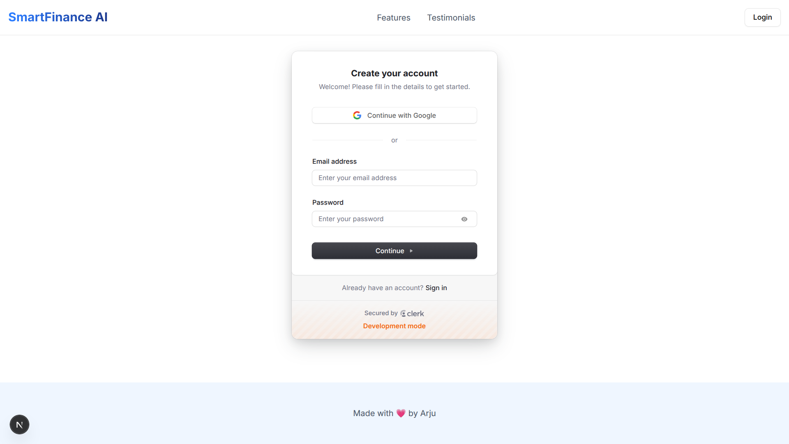
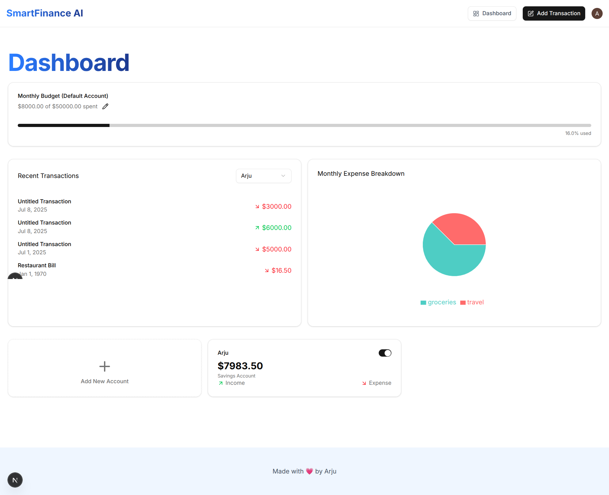
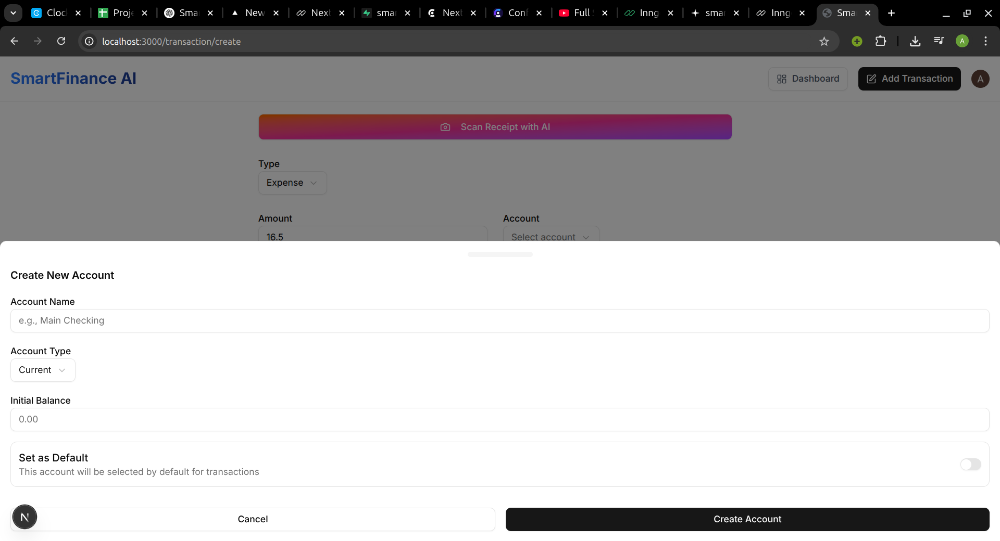
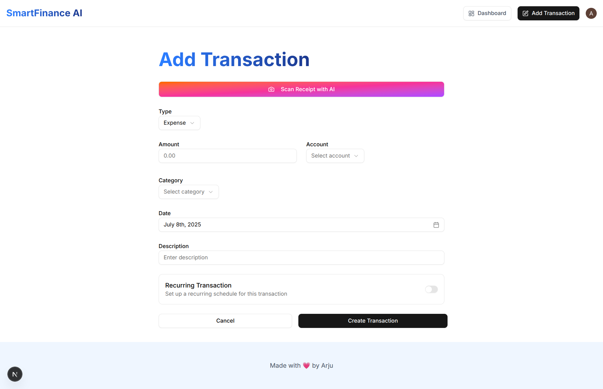
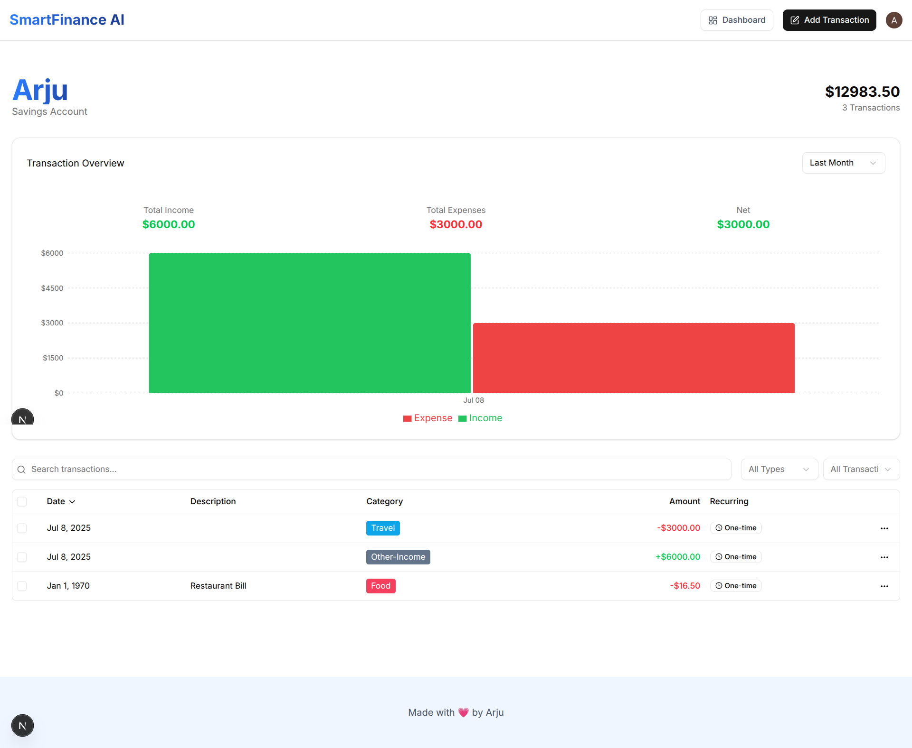

# 🚀 Smart Finance AI

**Smart Finance AI** is an AI-driven personal finance platform. Built with **Next.js**, **TypeScript**, **Tailwind CSS**, **Shadcn UI**, **Prisma**, **Inngest**, **Arcjet**, and **Clerk**, it helps users manage accounts, track spending, set budgets, and gain intelligent insights — securely and beautifully.

---

## 🌐 Live Demo

👉 [**Live Site**](https://smart-finance-ai-tau.vercel.app/)

---

## ⚙️ Tech Stack

- **Framework:** Next.js (App Router)
- **Styling:** Tailwind CSS, Shadcn UI, Radix UI
- **Backend:** Next.js API Routes, Prisma ORM
- **Auth:** Clerk for authentication & user sessions
- **Emails:** Resend, React Email
- **Background Jobs:** Inngest for scheduled tasks & cron jobs
- **AI:** Google Generative AI, AI receipt scanner
- **Charts & Visuals:** Recharts, Lucide React Icons
- **Forms & Validation:** React Hook Form, Zod
- **Security:** Arcjet (rate limiting, bot protection)
- **Deployment:** Vercel

---

## ✅ Core Features

- 🔑 **Authentication** — Sign up, sign in, session security via Clerk
- 🗂️ **Accounts** — Create, update, manage multiple accounts
- 💸 **Transactions** — Add, edit, bulk delete, filter & sort
- 🧾 **AI Receipt Scanner** — Auto-create transactions from receipts
- 📊 **Visual Reports** — Bar & pie charts for spending insights
- 📅 **Monthly Budgets** — Alerts & emails via Inngest & Resend
- 🔁 **Recurring Transactions** — Automated with Inngest cron jobs
- ✉️ **Monthly Reports** — AI-generated insights & email delivery
- 🛡️ **Security** — Rate limiting & bot protection with Arcjet

---

## 📸 Screenshots

| Page                     | Preview                                                                                                        |
| ------------------------ | -------------------------------------------------------------------------------------------------------------- |
| **Landing Page**         |                                                                      |
| **Sign In**              |                                                                  |
| **Dashboard**            |                                                                       |
| **Accounts**             |                                                                   |
| **Transactions**         |   |
| **Monthly Report Email** |                                                                          |

---

<!-- ## 📂 Project Structure

```bash
smart-finance-ai/
├── app/             # Next.js App Router
├── components/      # UI (Header, Drawer, Charts, Tables)
├── hooks/           # React hooks (API, auth)
├── lib/             # Inngest handlers, Arcjet config
├── models/          # Prisma schemas
├── pages/           # Static & dynamic routes
├── public/          # Static files & screenshots
├── styles/          # Tailwind & global styles
├── utils/           # AI helpers, seeds, utils
└── .env.local       # Env vars for DB, Clerk, Arcjet, Resend, AI
``` -->

---

## ⚡ Getting Started

**1️⃣ Clone**

```bash
git clone https://github.com/arju10/smart-finance-ai.git
cd smart-finance-ai
```

**2️⃣ Install**

```bash
npm install --legacy-peer-deps
```

**3️⃣ Environment Variables**

Create `.env` and add:

```env
NEXT_PUBLIC_CLERK_PUBLISHABLE_KEY=
CLERK_SECRET_KEY=
NEXT_PUBLIC_CLERK_SIGN_IN_URL=
NEXT_PUBLIC_CLERK_SIGN_UP_URL=
DATABASE_URL=
DIRECT_URL=
ARCJET_KEY=
RESEND_API_KEY=
GEMINI_API_KEY=

```

**4️⃣ Prisma**

```bash
npx prisma migrate dev --name init
npx prisma db seed
```

**5️⃣ Run**

```bash
npm run dev
```

---

## 🚀 Deployment

Production-ready with **Vercel** — push your repo, connect to Vercel, set environment variables, and deploy.

---

## 📬 Contact

Want to learn more or collaborate?

- **Email:** [mst.tahminajerinarju@gmail.com](mailto:mst.tahminajerinarju@gmail.com)
- **GitHub:** [github.com/arju10](https://github.com/arju10)
- **Linkedin:** [linkedin.com/in/arju10](https://linkedin.com/in/arju10)

---

## 📄 License

Apache

---

**⚡ Own your finances, powered by AI.**

---
